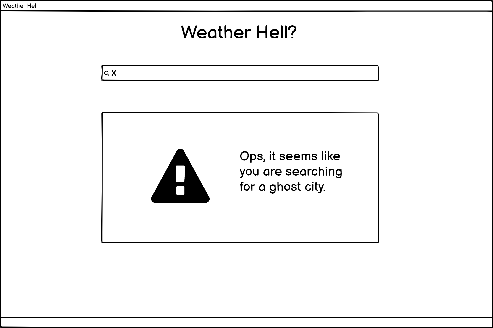

> This project was generated with [Angular CLI](https://github.com/angular/angular-cli) version 11.1.4.

# :cloud: Weather Hell
## About
Weather Hell is an application made for an internship selection process. The goal was to create a view to display data obtained from an API.

## Technologies
- HTML
- CSS
- Bootstrap
- Angular
- TypeScript
- Node 

## Requirements

### Node
To develop this application the Node version used was 12.0.0, because of its compatibility with Angular that requires npm version 6.  
To change the Node version, use the [nvm](https://github.com/coreybutler/nvm-windows)

## How to Run

Run `ng serve` for a dev server. Navigate to http://localhost:4200/.  
The app will automatically reload if you change any of the source files

## How to Use

On the input, type the name of the city you want to know about the weather.  

### Information displayed: 
- City Name
- Current date and time
- Icon that represents the weather
- Temperature given in °C
- A small description of the temperature
- The time when the data was collected

## Resources

### Mock Screens
To develop this project, at first the screens were modeled and the final application followed the template, made on [Balsamiq](https://balsamiq.cloud/).  

#### Empty page

#### Fulfilled page

#### API data

#### Error page

###

### Icons
The icons used in the application were taken from [Flaticon](https://www.flaticon.com/)

### API
The API utilized to retrieve the weather data was [Weatherstack](https://weatherstack.com/) with a free account

## :balance_scale: License

[MIT License](https://github.com/LBeghini/Weather-Hell/blob/main/LICENSE)
